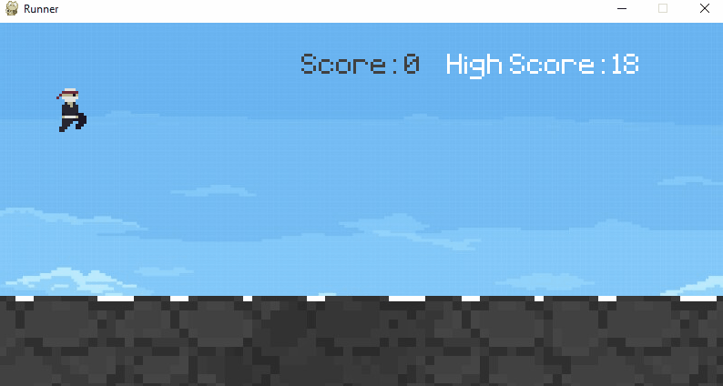

# Games 

# Runner #
[](https://github.com/Bachtran301/dinosaur-game/stargazers) [](https://github.com/Bachtran301/dinosaur-game/network)

## Introduction 



Runner is an exciting 2D platformer game built with Pygame. Players control a character who must jump over obstacles and collect coins while running through an ever-changing landscape.

## Features

- Multiple playable characters with unique animations
- Dynamic obstacle and coin spawning
- Increasing difficulty as the game progresses
- High score tracking and rankings system
- Character selection menu
- Multiple background environments

## Installation

1. Ensure you have Python installed on your system.

| Badge                                                                                                                 | URL                                                                                                       |
| --------------------------------------------------------------------------------------------------------------------- | --------------------------------------------------------------------------------------------------------- |
|  | `https://www.python.org/downloads/` |
2. Install Pygame:
```
pip install pygame-ce
```
3. Clone this repository or download the source code.
```
git clone https://github.com/Bachtran301/dinosaur-game.git
```
## How to run game
1. To view the high score table, follow these steps:
```
python app.py
```
2. Run game:
```
python main.py
```
## How to play game
<kbd>Space</kbd>: Jump
## Game Structure

### Player Class
- Manages player character animations and movement
- Handles gravity and jumping mechanics

### Obstacle Class

<p align="center">

</p>

- Creates various obstacles (fly, spikes, snail, tooth, bee, worm)
- Manages obstacle animations and movement

### Coin Class

<p align="center">

</p>

- Spawns gold and diamond coins
- Handles coin movement and collection

### Game States
<p align="center">

1. Initial Menu: Start or exit the game


2. Name Input: Players enter their name


3. Character Selection: Choose a character to play


4. Game Playing: Main gameplay loop


5. Rankings Display: Show high scores after game over


</p>

### Website High Scores

- Show history rank

<p align="center">

</p>

### Game Mechanics

- **Scoring**: Based on survival time and coin collection
- **Difficulty Progression**: Obstacles spawn more frequently as score increases
- **Collision Detection**: Between player, obstacles, and coins
- **High Score System**: Tracks and displays top scores

### Graphics and Animation

- Multiple character sprites with walking and jumping animations
- Various obstacle types with unique animations
- Dynamic background that changes based on score

### Audio


## Customization

- New characters can be added by creating appropriate sprite sheets and updating the `Player` class
- Additional obstacles can be introduced by adding new entries to the `Obstacle` class

## Troubleshooting

- Ensure all image files are in the correct directories
- Check Pygame installation if you encounter import errors

## Future Enhancements

- Implement background music and sound effects
- Add power-ups and special abilities for characters
- Create more diverse environments and obstacles

## Credits

This game was created using Pygame. Character and obstacle sprites are custom-made for this project.

# Major Companies

A selection of major edit studios, publishers, etc. using GitHub:

[](https://github.com/aseprite)&nbsp;
[](https://github.com/adobe-photoshop)&nbsp;
[](https://github.com/lospec)&nbsp;
[](https://github.com/unity-technologies)&nbsp;
[](https://github.com/godotengine)&nbsp;
[](https://github.com/pygame)&nbsp;
[](https://github.com/microsoft)&nbsp;


